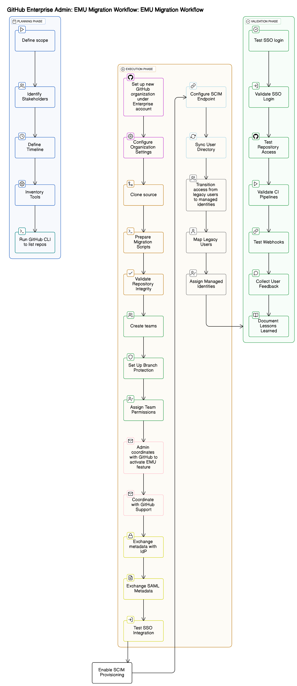

# GitHub Enterprise Migration with EMU Enablement

## Overview
This document outlines the enterprise-level strategy and technical execution plan for migrating repositories from standard GitHub accounts to GitHub Enterprise Cloud, followed by enabling and adopting GitHub Enterprise Managed Users (EMU). The goal is to centralize identity management, enforce security policies, and ensure compliance across the organization's software development lifecycle.

## Visual Overview

## Phase 1: GitHub to GitHub Enterprise Cloud Migration

### Objectives:
- Audit all existing repositories and contributors
- Migrate repositories to the new GitHub Enterprise organization
- Preserve commit history, branches, issues, and pull requests
- Set up permissions and access controls according to enterprise standards

### Tasks:
1. [**Repository Audit**](./docs/tasks/repository_audit.md)
   - Identify all repositories to be migrated
   - Document contributors, branches, and dependencies

2. [**Target Org Setup**](./docs/tasks/target_org_setup.md)
   - Create the new GitHub Enterprise organization
   - Define teams, roles, and access levels

3. [**Repository Migration**](./docs/tasks/repository_migration.md)
   - Clone repositories locally
   - Push to new GitHub Enterprise remote
   - Validate data integrity (commits, tags, issues, wikis)

4. [**Tooling Integration**](./doc/tasks/tooling_integration.md)
   - Update CI/CD pipelines, webhooks, and integrations to point to new repositories

5. [**Validation**](./docs/tasks/validation.md)
   - Perform functional testing to confirm stability post-migration

## Phase 2: GitHub Enterprise Managed Users (EMU) Enablement

### Objectives:
- Transition identity and access management to GitHub EMU
- Integrate with corporate Identity Provider (IdP) for SAML-based SSO
- Enable SCIM provisioning for automated user lifecycle management

### Prerequisites:
- Active GitHub Enterprise Cloud subscription
- Verified domain ownership
- Admin access to GitHub organization
- Access to a supported IdP (Azure AD, Okta, etc.)

### Tasks:
1. [**Request EMU Enablement**](./docs/tasks/request_emu_enablement.md)
   - Coordinate with GitHub account team to enable EMU features

2. [**Configure SAML SSO**](./docs/tasks/configure_saml_sso.md)
   - Exchange metadata between GitHub and IdP
   - Configure SAML in both GitHub and IdP dashboards
   - Enforce SSO for all users

3. [**Enable SCIM Provisioning**](./docs/tasks/enable_scim_provisioning.md)
   - Configure SCIM in IdP to automate user account provisioning
   - Validate synchronization of user data with GitHub EMU

4. [**User Mapping and Access Transition**](./docs/tasks/user_mapping_and_access.md)
   - Map existing users to EMU identities via email or external ID
   - Migrate repository ownership and access to EMU accounts

5. [**Post-Migration Validation**](./docs/tasks/post_migration_validation.md)
   - Confirm SSO authentication works across CLI and Web UI
   - Audit team memberships, permissions, and repo access
   - Monitor for access errors or broken integrations

## Deliverables
- Migration runbooks and checklists
- SAML and SCIM configuration documentation
- Identity mapping matrix
- Post-migration access audit reports
- Internal wiki with setup instructions for EMU onboarding

## Governance and Compliance
- SSO enforcement across all tools and workflows
- Role-based access control aligned with organizational policy
- Regular audits of user access and repository permissions
- Documentation of incident response and recovery procedures

##  Milestones
| Milestone                           
|----------------------------------|
| Repo Audit & Org Setup           | 
| GitHub Migration Execution       |
| EMU Enablement Request           | 
| SAML & SCIM Configuration        | 
| User Mapping & Access Migration  | 
| Post-Migration Validation        | 

## Timeline and Milestones

| Milestone                                              | Done  | Documented |
|--------------------------------------------------------|-------|------------|
| [Repo Audit](docs/tasks/repository_audit.md)           | Done  | Done       |
| [Target Org Setup](docs/tasks/target_org_setup.md)     | Done  | Done       |
| [GitHub Migration Execution](docs/tasks/repository_migration.md) | Done  | Done       |
| [Tooling Integration](docs/tasks/tooling_integration.md) | Done  | Done       |
| [Validation](docs/tasks/validation.md)                 | Done  | Done       |
| [EMU Enablement Request](docs/tasks/request_emu_enablement.md) | Done  | Done       |
| [SAML Configuration](docs/tasks/configure_saml_sso.md) | Done  | Done       |
| [SCIM Provisioning](docs/tasks/enable_scim_provisioning.md) | Done  | Done       |
| [User Mapping & Access Migration](docs/tasks/user_mapping_and_access.md) | Done  | Done       |
| [Post-Migration Validation](docs/tasks/post_migration_validation.md) | Done  | Done       |

## Contact and Ownership
- **Project Lead:** Anamika Sanjay
- **Support Contacts:** IAM Admin, GitHub Org Owner, DevSecOps Team
- **Documentation Repository:** `https://github.com/ANSANJAY/github-enterprise-emu-migration`

---

This documentation is intended to serve as the master reference for all teams involved in the GitHub Enterprise migration and EMU enablement initiative.

